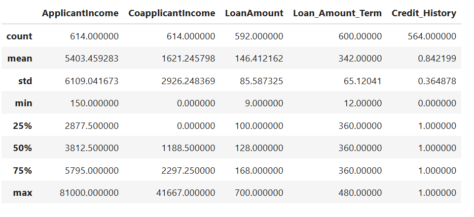

# 🏦 Loan Approval Prediction

## 📌 Overview
This **Loan Approval Prediction** project is a machine learning model designed to predict whether a loan application will be approved or rejected based on various financial and demographic factors. The project uses **Python** and **Jupyter Notebook (.ipynb)** for data analysis, preprocessing, model training, and evaluation.

## ✨ Features
✅ **Data Preprocessing** – Cleans and processes raw data for accurate predictions.  
✅ **Exploratory Data Analysis (EDA)** – Provides insights into key factors affecting loan approval.  
✅ **Machine Learning Model** – Implements various classification algorithms (e.g., Logistic Regression, Decision Trees, Random Forest, etc.).  
✅ **Model Evaluation** – Assesses model performance using accuracy, precision, recall, and F1-score.  
✅ **User Input Testing** – Allows users to test loan applications on trained models.  

---

## 📸 Screenshots

### 📊 Data Exploration



### ✅ Prediction Results


---

## 🚀 How to Run the Project

### **1️⃣ Install Python and Jupyter Notebook**  
Ensure you have **Python 3.10** installed. You can install Jupyter Notebook using:
```sh
pip install jupyterlab
```

### **2️⃣ Clone or Download the Project**
```sh
git clone https://github.com/Sudhanshu-2596/loan-approval-prediction.git
cd loan-approval-prediction
```

### **3️⃣ Install Required Dependencies**
```sh
pip install pandas numpy matplotlib seaborn scikit-learn
```

### **4️⃣ Open Jupyter Notebook**
```sh
jupyter notebook
```
Then, open **`loan approval prediction.ipynb`** and run the cells in order.

---

## 📌 Requirements
✅ **Python 3.10**  
✅ **Jupyter Notebook**  
✅ **Libraries Used:**  
- **pandas** – Data manipulation  
- **numpy** – Numerical computing  
- **matplotlib & seaborn** – Data visualization  
- **scikit-learn** – Machine learning models  

---

## 🛠 Future Enhancements  
🔹 **Web Interface (Flask/Django)** – Deploy the model as a web app for user-friendly interaction.  
🔹 **Feature Engineering** – Improve model accuracy with better feature selection.  
🔹 **Hyperparameter Tuning** – Optimize machine learning models for better performance.  
🔹 **Deployment on Cloud** – Deploy on AWS/GCP for real-time loan predictions.  

---

## 👨‍💻 Author
👤 **Sudhanshu Raj**  
📧 Email: sudhanshuraj259@gmail.com  
🔹 GitHub: https://github.com/Sudhanshu-2596

---
